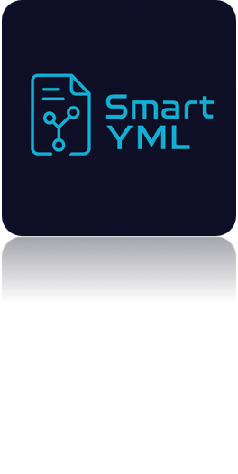

# 🚀 Smart YML - GENERACIÓN AUTOMÁTICA DE PLANTILLAS PARA EL DESPLIEGUE DE APLICACIONES MEDIANTE INTELIGENCIA ARTIFICIAL  



Class: Trabajo de grado  
Code: 2404  
Members:

- John Paul Jasin Martinez - @jpjassinm  
- Andrés Felipe Rodríguez Roa - @japipe05  

---

## 📚 Índice

- [🚀 Smart YML](#-smart-yml)
- [🧠 Arquitectura General](#-arquitectura-general)
- [🌐 Frontend - Next.js 15](#-frontend---nextjs-15)
- [🔧 Backend - Python FastAPI](#-backend---python-fastapi)
- [🐳 Preparado para Docker](#-preparado-para-docker)
- [🧪 Buenas Prácticas](#-buenas-prácticas)
- [✨ ¿Por Qué Usar Jave Smart YML?](#-por-qué-usar-jave-smart-yml)
- [🤝 Contribuciones](#-contribuciones)
- [👨‍💻 Desarrollado por](#-desarrollado-por)
- [📄 Licencia](#-licencia)
- [🏗️ Estructura del Proyecto](#️-estructura-del-proyecto)
- [📷 Arquitecturas y Vistas](#-arquitecturas-y-vistas)
- [🗃️ Consultas a la Base de Datos](#️-consultas-a-la-base-de-datos)

---

## 🚀 Smart YML 

Bienvenido a **Smart YML**, una solución fullstack de última generación...

---

## 🧠 Arquitectura General

📦 El proyecto está dividido en dos módulos principales...

---

## 🌐 Frontend - Next.js 15

📁 Ruta: `./Frontend/`  
✨ Tecnologías y características...

### 🚀 Ejecutar el Frontend

```bash
cd Frontend
npm install
npm run dev
```

---

## 🔧 Backend - Python FastAPI

📁 Ruta: `./Backend/`  
✨ Tecnologías y características...

### 🚀 Ejecutar el Backend

```bash
cd Backend
pip install -r requirements.txt
uvicorn main:app --reload
```

---

## 🐳 Preparado para Docker

Lanza toda la plataforma utilizando Docker Compose:

```bash
docker-compose up --build
```

---

## 🧪 Buenas Prácticas

- ✅ Código limpio y escalable  
- ✅ Separación clara de responsabilidades  
- ✅ Entorno `.env` seguro y configurable  
- ✅ Listo para pruebas de integración  

---

## ✨ ¿Por Qué Usar Jave Smart YML?

- ✅ Desarrollo rápido  
- ✅ Escalable  
- ✅ Dockerizado  
- ✅ Diseño moderno  

---

## 🤝 Contribuciones

Este proyecto está abierto a la comunidad...

---

## 👨‍💻 Desarrollado por

**Jave Smart Labs**  
💡 Tecnología con propósito. Innovación con resultados.

---

## 📄 Licencia

MIT — ¡Úsalo libremente y comparte el conocimiento!

---


## 🏗️ Estructura del Proyecto

**Frontend/**
```
├── app/                    # App Router (Next.js 13+)
│   ├── layout.tsx          # Diseño principal
│   ├── page.tsx            # Página raíz
│   └── ...(rutas)/
├── components/             # Componentes reutilizables
├── styles/                 # Estilos globales (Tailwind config, etc)
├── public/                 # Archivos públicos (imágenes, íconos)
├── utils/                  # Utilidades y helpers
├── hooks/                  # Custom Hooks de React
├── services/               # Lógica de acceso a APIs externas
├── middleware.ts           # Middlewares de Next.js
├── tailwind.config.ts      # Configuración de Tailwind
├── next.config.js          # Configuración de Next.js
├── tsconfig.json           # Configuración de TypeScript
├── .eslintrc.json          # Reglas de linting
├── .prettierrc             # Formato de código
├── Dockerfile              # Imagen Docker del Frontend
├── package.json            # Dependencias y scripts
└── README.md               # Documentación del frontend
```

**Backend/**
```
├── app/
│   ├── main.py             # Punto de entrada de la app
│   ├── api/                # Rutas organizadas por módulos
│   │   ├── v1/
│   │   │   ├── endpoints/  # Archivos de rutas
│   │   │   └── __init__.py
│   ├── core/               # Configuración general (ajustes, logs, etc)
│   ├── models/             # Modelos de base de datos (Pydantic y/o ORM)
│   ├── schemas/            # Esquemas Pydantic
│   ├── services/           # Lógica de negocio
│   ├── db/                 # Configuración de base de datos
│   ├── utils/              # Funciones auxiliares
│   └── middleware/         # Middlewares personalizados
├── tests/                  # Pruebas unitarias y de integración
├── requirements.txt        # Dependencias del proyecto
├── .env                    # Variables de entorno
├── Dockerfile              # Imagen Docker del backend
└── README.md               # Documentación del backend
```


---

## 📷 Arquitecturas y Vistas

### Arquitectura AS-IS  


### Arquitectura To-Be  


### Login  


### Registro  


### Chat Web  


---

## 🗃️ Consultas a la Base de Datos

### 🐘 PostgreSQL

```sql
SELECT * FROM prompts;
```

### 🔹 Cassandra

```sql
DESCRIBE KEYSPACES;
DESCRIBE TABLES;
SELECT * FROM appkeyspace.users;
```
