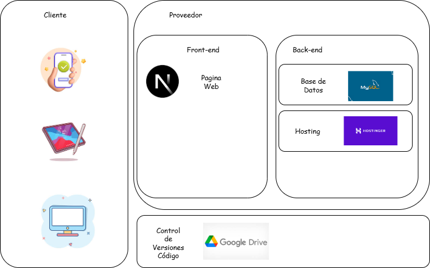
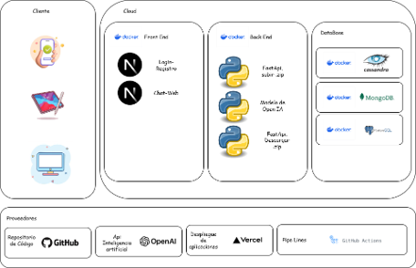
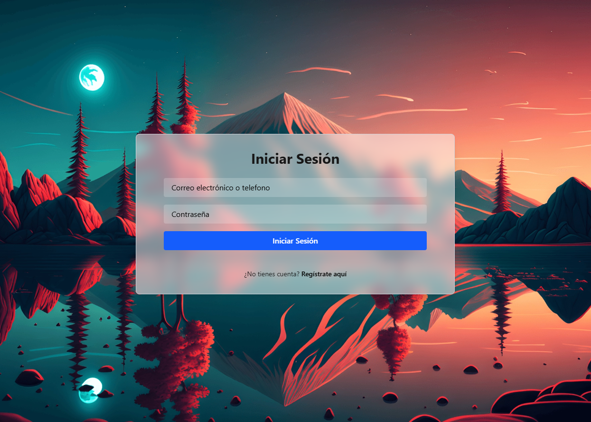
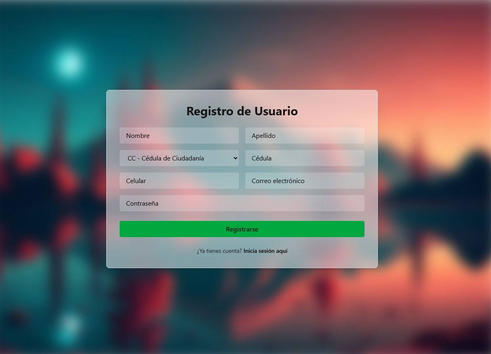
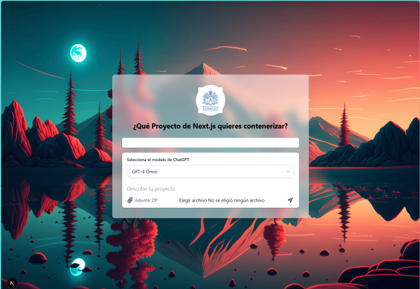

# 🚀 Jave Smart YML - Plataforma Fullstack Inteligente

Bienvenido a **Jave Smart YML**, una solución fullstack de última generación que combina lo mejor del desarrollo moderno con herramientas poderosas y arquitectura escalable. Esta plataforma es ideal para lanzar MVPs, startups o productos robustos de clase empresarial.

---

## 🧠 Arquitectura General

📦 Proyecto dividido en dos módulos:

- 🖥️ **Frontend:** Next.js 15 + Tailwind + TypeScript  
- 🧪 **Backend:** FastAPI + Python + Arquitectura modular

Todo integrado con soporte para Docker, despliegue continuo y buenas prácticas desde el inicio.

---

## 🌐 Frontend - Next.js 15

📁 Ruta: `./Frontend/`

✨ **Stack & Features:**

- 🔥 Next.js 15 (App Router)
- 💨 Tailwind CSS
- 🧠 TypeScript
- 🌐 PWA Ready
- ⚙️ ESLint + Prettier + Docker
- ⚡ Arquitectura limpia y escalable

### 🚀 Ejecutar Frontend

cd Frontend
npm install
npm run dev

---

## 🔧 Backend - Python FastAPI

📁 Ruta: `./Backend/`

✨ **Stack & Features:**

- ⚡ FastAPI
- 🐍 Python 3.11+
- 🔐 JWT Authentication
- 🗂️ Modular: routers, models, services, config
- 📄 Swagger UI y OpenAPI
- 🐳 Docker Ready
- 🛢️ Soporte Cassandra / MongoDB / SQL

### 🚀 Ejecutar Backend

cd Backend
pip install -r requirements.txt
uvicorn main:app --reload

---

## 🐳 Docker Ready

Lanza toda la plataforma con Docker Compose:

docker-compose up --build

Configuración optimizada para ambientes de desarrollo y producción.

---

## 🧪 Buenas Prácticas

- ✅ Código limpio y escalable
- ✅ Separación clara de responsabilidades
- ✅ Entorno `.env` seguro y configurable
- ✅ Pruebas listas para integración

---

## ✨ ¿Por qué usar Jave Smart YML?

- ✅ **Desarrollo veloz** con herramientas modernas
- ✅ **Escalable** para startups o sistemas empresariales
- ✅ **Dockerizado** y listo para la nube
- ✅ **Diseño moderno y experiencia fluida**

---

## 🤝 Contribuciones

Este proyecto está abierto a la comunidad. Si quieres aportar mejoras, ¡haz un fork y un PR!

---

## 👨‍💻 Desarrollado por

**Jave Smart Labs**  
💡 Tecnología con propósito. Innovación con resultados.

---

## 📄 Licencia

MIT — ¡Úsalo libremente y comparte el conocimiento!


### <a id='1'>Arquitectura AS-IS</a> 




### <a id='2'>Arquitectura To-Be</a> 



### <a id='3'>Login</a> 



### <a id='4'>Registro</a> 



### <a id='5'>Chat Web</a> 



### <a id='6'>Estructura de carpetas</a> 

Frontend/
├── app/                    # App Router (Next.js 13+)
│   ├── layout.tsx          # Layout principal
│   ├── page.tsx            # Página raíz
│   └── ...(rutas)/
├── components/             # Componentes reutilizables
├── styles/                 # Estilos globales (Tailwind config, etc)
├── public/                 # Archivos públicos (imágenes, icons)
├── utils/                  # Utilidades y helpers
├── hooks/                  # Custom React Hooks
├── services/               # Lógica de acceso a APIs externas
├── middleware.ts           # Middlewares Next.js
├── tailwind.config.ts      # Configuración Tailwind
├── next.config.js          # Configuración de Next.js
├── tsconfig.json           # Configuración TypeScript
├── .eslintrc.json          # Reglas de linting
├── .prettierrc             # Formato de código
├── Dockerfile              # Imagen del Frontend
├── package.json            # Dependencias y scripts
└── README.md               # Documentación específica del frontend

Backend/
├── app/
│   ├── main.py             # Punto de entrada de la app
│   ├── api/                # Rutas organizadas por módulos
│   │   ├── v1/
│   │   │   ├── endpoints/  # Archivos de rutas
│   │   │   └── __init__.py
│   ├── core/               # Configuración general (settings, logging, etc)
│   ├── models/             # Modelos de base de datos (Pydantic y/o ORM)
│   ├── schemas/            # Esquemas Pydantic
│   ├── services/           # Lógica de negocio
│   ├── db/                 # Configuración de base de datos
│   ├── utils/              # Funciones auxiliares
│   └── middleware/         # Middlewares personalizados
├── tests/                  # Pruebas unitarias y de integración
├── requirements.txt        # Dependencias del proyecto
├── .env                    # Variables de entorno
├── Dockerfile              # Imagen del backend
└── README.md               # Documentación específica del backend

## 🗃️ Consultas de Base de Datos

### 🐘 PostgreSQL

Consulta la tabla de *prompts*:

```sql
SELECT * FROM prompts;
```

### Cassandra

```sql
DESCRIBE KEYSPACES;
DESCRIBE TABLES;
select * from appkeyspace.users;
```

### Para local en Docker

```Bash
docker-compose up --build -d
```